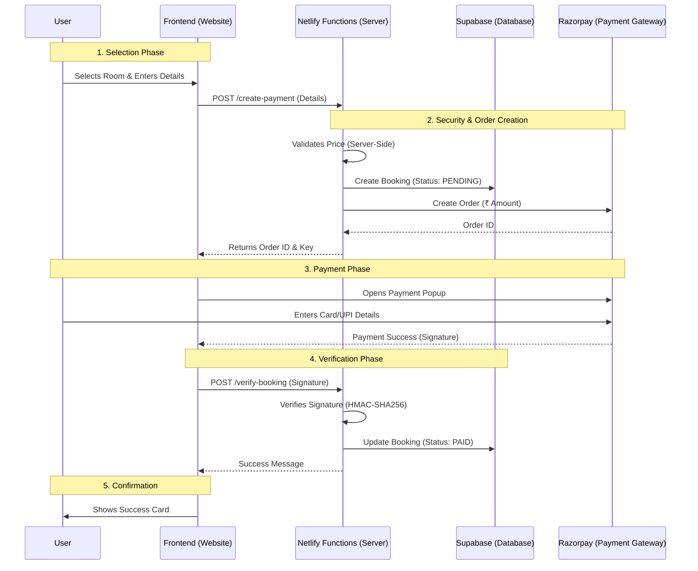

# Sunyatee Retreat Booking System Documentation

## 1. Project Overview
**Project Name**: Sunyatee Retreat Booking Platform
**Goal**: A secure, responsive web application for users to book retreat rooms at "Shantivan".
**Status**: **Production Live** (Payments Active)

## 2. Technology Stack
The application is built on a modern **Serverless Architecture** to ensure low cost, high scalability, and security.

| Layer | Technology | Purpose |
| :--- | :--- | :--- |
| **Frontend** | HTML5, CSS3, JavaScript | Fast, responsive user interface. No heavy framework overhead. |
| **Backend** | Netlify Functions (Node.js) | Serverless API endpoints for secure logic (creating orders, verifying payments). |
| **Database** | Supabase (PostgreSQL) | Stores booking records securely. |
| **Payments** | Razorpay | Secure payment gateway for processing transactions. |

## 3. Booking Flow Chart
This diagram illustrates the secure journey of a user booking a room.

## 4. Key Security Features
1.  **Server-Side Price Validation**: Prices are checked on the server. If a user tries to tamper with the price in the browser (e.g., changing ₹2500 to ₹1), the server rejects it.
2.  **Signature Verification**: The system is protected against "Fake Success" attacks. We cryptographically verify every payment confirmation using a secure key that only our server knows.
3.  **Environment Variables**: All sensitive API keys (Razorpay Secrets, Database Keys) are stored in the secure Netlify environment, never in the public code.

## 5. User Features
-   **Dynamic Pricing**: Prices automatically adjust based on room selection.
-   **Responsive Design**: Works seamlessly on Mobile, Tablet, and Desktop.
-   **Instant Confirmation**: Users receive immediate booking confirmation upon payment.
-   **Data Integrity**: All bookings are permanently recorded in a robust SQL database.
